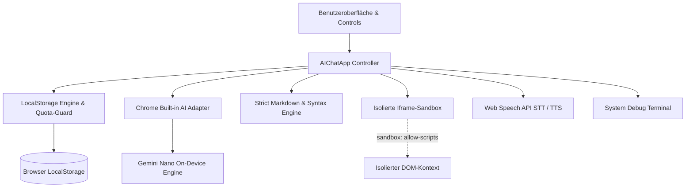
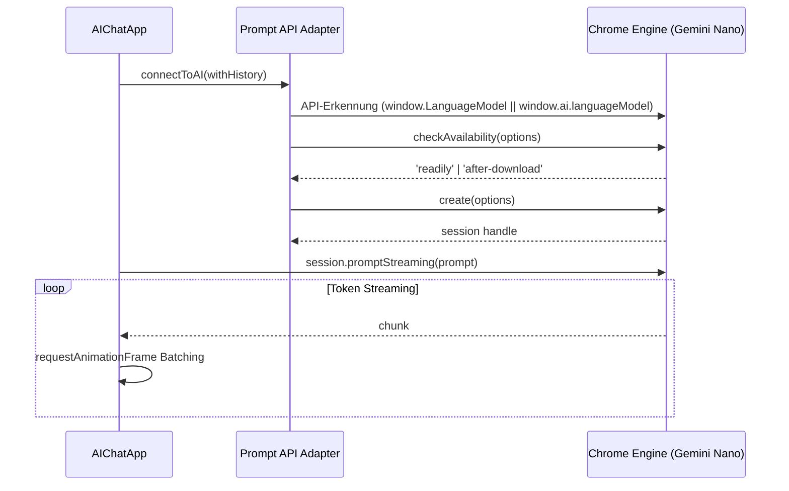
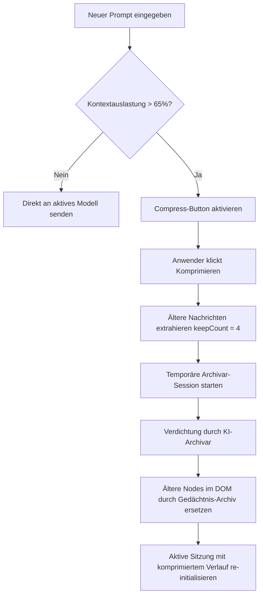

# Architektur-Dokumentation: LOCAL

**LOCAL** (*Lokale Offline Chat Anwendungs-Logik*) ist ein autarker, serverloser KI-Chat-Client. Dieses Dokument beschreibt die Systemarchitektur, den internen Datenfluss, das Sicherheitsmodell und die Algorithmen zur Kontext-Verwaltung.

---

## 1. Design-Prinzipien

1. **Zero-Dependency & Self-Contained:**
   Die gesamte Anwendung residiert in einer einzigen HTML-Datei (`index.html`). Keine Build-Schritte, kein Webpack/Vite, keine externen CDN-Abhängigkeiten. Funktioniert via `file://`-Protokoll direkt aus dem Dateisystem.
2. **Local-First & Zero-Data-Leak:**
   Sämtliche Inferenz-Berechnungen, Speicherungen und DOM-Transformationen finden exklusiv auf dem Endgerät des Anwenders statt.
3. **Defense-in-Depth & Sandbox-Isolation:**
   Generierter Code wird strikt von der Host-Anwendung getrennt ausgeführt. Markdown-Parsing folgt einer mehrstufigen Sanitization-Pipeline.
4. **Resilienz & Fehlerabfangung:**
   Ein eingebettetes Debug-Terminal fängt Laufzeitfehler ab; Speicher-Quotas und API-Verbindungsfehler werden transparent signalisiert.

---

## 2. Komponenten-Architektur



### 2.1 Der `AIChatApp` Controller
Der Controller kapselt den gesamten Applikationszustand in einer ES6-Klasse:
- **`dom`:** Gecachte DOM-Referenzen zur Vermeidung von wiederholten Suchabfragen (`getElementById`).
- **`state`:** Hält aktive Sitzungs-IDs, Streaming-Abbruch-Flags (`isAborted`), Auto-Scroll-Zustand, temporäre Dateikontexte und In-Memory-Logs.
- **`CONFIG`:** Zentrale Konstanten für Schwellenwerte, Timeouts, Puffergrenzen und Serialisierungs-Marker.

---

## 3. Chrome Prompt API Adapter Layer

Die Spezifikation der Chrome Built-in AI (WICG Prompt API) befindet sich in stetiger Weiterentwicklung. Der Adapter in `LOCAL` abstrahiert Versionsunterschiede:



### Frame-gebündeltes Streaming
Um UI-Freezes und *Layout-Thrashing* bei hochfrequenten Token-Streams zu verhindern, werden eintreffende Chunks akkumuliert und über `requestAnimationFrame` gebündelt in das DOM gerendert.

---

## 4. Smart Context Compression (Sliding-Window)

Lokale Modelle wie Gemini Nano besitzen ein begrenztes Kontextfenster (~4.096 Tokens). Bei langen Chats drohen Qualitätsverlust oder OOM-Abbrüche.



1. **Beobachtung & Telemetrie:** 
   - **Zweistufige Telemetrie:** Die App liest primär die synchronen Session-Eigenschaften `tokensSoFar` und `maxTokens` der Prompt API aus. Stehen diese nicht direkt zur Verfügung, wird im Hintergrund ein debounctes `session.countPromptTokens()` ausgeführt.
   - **Heuristischer Fallback:** Ist noch keine KI-Session aktiv oder unterstützt der Browser die Methoden nicht, berechnet die App die Auslastung präzise über die Zeichenanzahl im Verhältnis zu `CONFIG.MAX_CONTEXT_CHARS` (12.000 Zeichen).
   - **Header-Telemetrie:** Ein Live-Badge (`📊 X / Y Tok (Z%)`) im Header visualisiert den exakten Speicherstand ohne Hover-Bedarf.
2. **Archivierung:** Bei Schwellenwertüberschreitung (>65 %) wird der Komprimierungs-Button eingeblendet. Bei Auslösung werden alle Nachrichten bis auf die letzten 4 Chunks gebündelt und an eine separate, flüchtige `summarySession` übergeben.
3. **Re-Injektion:** Die Antwort des Archivars wird als hervorgehobenes `sys-msg-context`-Element vorangestellt und in nachfolgende System-Prompts übernommen.

---

## 5. Sicherheits- & Härtungsmodell

### 5.1 Strict Markdown Parsing & Syntax Tokenizer
Die Pipeline eliminiert XSS-Vektoren und verhindert Syntax-Mangles:
1. **Codeblock-Extraktion:** Codeblöcke werden vor dem Escaping extrahiert und durch kryptografisch zufällige Platzhalter (`__LOCAL_CB_<random>_<timestamp>__`) ersetzt. Dies schließt Token-Kollisionen aus.
2. **Strict HTML-Escaping:** Der restliche Fließtext wird vollständig maskiert (`&`, `<`, `>`, `"`, `'`).
3. **Token-First Syntax Highlighting:** Der Syntax-Highlighter tokenisiert den unmaskierten Quelltext in Schlüsselwörter, Zeichenketten, Kommentare und Zahlen. Erst beim Erzeugen der HTML-Spans wird jedes Token individuell encodiert. Dadurch können Zahlen innerhalb von HTML-Entities (z. B. `&#039;`) niemals fehlerhaft als Zahlen-Token interpretiert werden.

### 5.2 Iframe Sandbox Isolation
Code-Snippets können direkt im Chat ausgeführt werden:
```html
<iframe class="code-output-frame" sandbox="allow-scripts"></iframe>
```
- **Kein `allow-same-origin`:** Die Sandbox besitzt keine Rechte auf `localStorage`, Cookies oder den DOM-Baum der übergeordneten Anwendung.
- **Kein `allow-top-navigation`:** Das Frame kann den Browser nicht umleiten.
- **Toggle & Reset:** Der Anwender kann geöffnete Sandboxes jederzeit mit `⏹ Schließen` entladen und den Speicher freigeben.

### 5.3 LocalStorage Quota-Guard
Browser begrenzen den `localStorage` in der Regel auf 5 bis 10 MB. Bei Überschreitung wirft der Browser einen `QuotaExceededError`. 
`saveSessionsToStorage()` fängt diesen Fehler ab, verhindert Dateninkonsistenzen und informiert den Anwender im Chat über den vollen Speicher.

---

## 6. Daten- und Speicherformat

Chats werden in einem menschenlesbaren, zeilenbasierten Format exportiert und importiert:

```text
--- Lokaler KI-Chat Export ---

---[System]---
System-Anweisung oder Archiv-Kontext...

---[Du]---
Benutzereingabe...

---[KI]---
Antwort der lokalen KI...
```

Vorteile:
- Keine JSON-Escape-Probleme bei massiven Markdown- und Code-Snippets.
- Vollständig kompatibel mit Unix-Kommandozeilen-Tools (`grep`, `awk`, `diff`).
- Verlustfreie Roundtrip-Serialisierung durch automatisierte Tests verifiziert.
