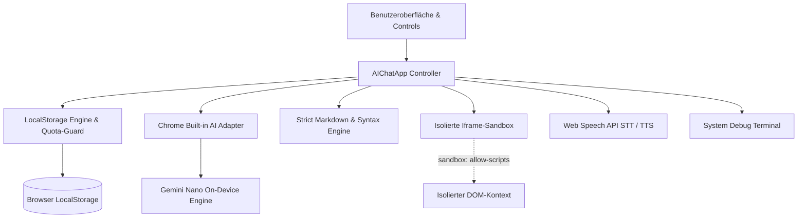
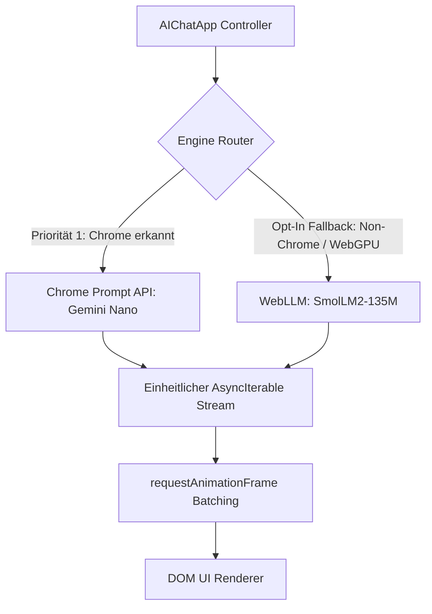
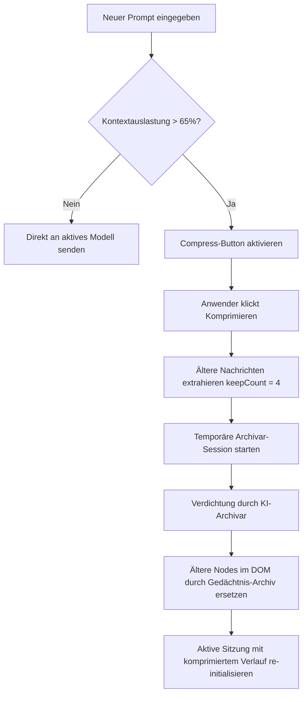

# Architektur-Dokumentation: LOCAL

**LOCAL** (*Lokale Offline Chat Anwendungs-Logik*) ist ein autarker, serverloser KI-Chat-Client. Dieses Dokument beschreibt die Systemarchitektur, den internen Datenfluss, das Sicherheitsmodell und die Algorithmen zur Kontext-Verwaltung.

---

## 1. Design-Prinzipien

1. **Zero-Dependency & Self-Contained:**
   Die gesamte Anwendung residiert in einer einzigen HTML-Datei (`index.html`). Keine Build-Schritte, kein Webpack/Vite, keine externen CDN-Abhängigkeiten. Funktioniert via `file://`-Protokoll direkt aus dem Dateisystem.
2. **Local-First & Zero-Data-Leak:**
   Sämtliche Inferenz-Berechnungen, Speicherungen und DOM-Transformationen finden exklusiv auf dem Endgerät des Anwenders statt.
3. **Defense-in-Depth & Sandbox-Isolation:**
   Generierter Code wird strikt von der Host-Anwendung getrennt ausgeführt. Markdown-Parsing folgt einer mehrstufigen Sanitization-Pipeline.
4. **Resilienz & Fehlerabfangung:**
   Ein eingebettetes Debug-Terminal fängt Laufzeitfehler ab; Speicher-Quotas und API-Verbindungsfehler werden transparent signalisiert.

---

## 2. Komponenten-Architektur



### 2.1 Der `AIChatApp` Controller
Der Controller kapselt den gesamten Applikationszustand in einer ES6-Klasse:
- **`dom`:** Gecachte DOM-Referenzen zur Vermeidung von wiederholten Suchabfragen (`getElementById`).
- **`state`:** Hält aktive Sitzungs-IDs, Streaming-Abbruch-Flags (`isAborted`), Auto-Scroll-Zustand, temporäre Dateikontexte und In-Memory-Logs.
- **`CONFIG`:** Zentrale Konstanten für Schwellenwerte, Timeouts, Puffergrenzen und Serialisierungs-Marker.

---

## 3. Hybrid-Engine & Adapter Layer

`LOCAL` nutzt ein duales Engine-Modell mit strikter Priorisierung von nativer On-Device-Hardware:



### 3.1 Die Priorität-1 Garantie für Google Chrome (Gemini Nano)
Befindet sich der Anwender in Google Chrome oder Chrome Canary mit aktivierter Prompt API, läuft die Anwendung zu 100 % über die native C++-Engine des Browsers:
- **0 Byte Netzwerklast:** Kein Herunterladen externer Bundles, Bibliotheken oder Gewichte.
- **Volle Telemetrie:** Direkte Abfrage synchroner Hardware-Properties (`tokensSoFar`, `maxTokens`).

### 3.2 Der Opt-In WebGPU Fallback (WebLLM)
In Nicht-Chromium-Browsern (Firefox, Safari) oder bei fehlenden Chrome-Flags ermittelt die Systemdiagnose das Vorhandensein von `navigator.gpu`.
- **On-Demand ESM-Import:** Erst nach explizitem Klick auf *„⚡ WebGPU-Fallback laden“* wird `@mlc-ai/web-llm` dynamisch nachgeladen.
- **Kompaktes Modell:** Nutzung von `SmolLM2-135M-Instruct-q4f16_1-MLC` (~90 MB), welches automatisch in der browserinternen Cache/IndexedDB persistiert wird.
- **Einheitlicher Session-Vertrag:** Der WebGPU-Adapter kapselt das OpenAI-kompatible Streaming in dieselbe Async-Generator-Schnittstelle (`promptStreaming()`), sodass Chatverlauf, UI-Batching und Kontext-Zählung ohne Sonderbehandlung weiterarbeiten.

### 3.3 Frame-gebündeltes Streaming
Um UI-Freezes und *Layout-Thrashing* bei hochfrequenten Token-Streams zu verhindern, werden eintreffende Chunks akkumuliert und über `requestAnimationFrame` gebündelt in das DOM gerendert.

### 3.1 System-Diagnose & Troubleshooting State Machine
Schlägt `connectToAI()` fehl oder befindet sich das Modell nicht im Zustand `'readily'`, initiiert `checkSystemEnvironment()` eine deterministische Diagnose:

| State | Kriterium | Ursache & Automatische Handlungsanleitung |
| :--- | :--- | :--- |
| `NON_CHROMIUM` | `!isChromium` | Browser ist Firefox/Safari. Verweis auf Chrome / Chrome Canary. |
| `NO_FLAGS` | `!window.LanguageModel && !window.ai` | Prompt API Flag deaktiviert. Anleitung für `chrome://flags/#prompt-api-for-gemini-nano` und Relaunch. |
| `NEEDS_DOWNLOAD` | `availability === 'after-download' \|\| 'downloadable'` | Modell (~1,7 GB) fehlt. Anleitung für `chrome://components` (Optimization Guide Update). |
| `PERF_OR_STORAGE_BLOCKED` | `availability === 'no' \|\| 'unavailable'` | Hardware-/Speicher-Prüfung schlägt fehl (besonders unter Windows). Anleitung für `chrome://flags/#optimization-guide-on-device-model` -> `Enabled BypassPerfRequirement`, Prüfung auf mind. 22 GB auf Laufwerk C:, Deaktivierung getakteter Verbindungen. |
| `READY` | `availability === 'readily'` | Modell einsatzbereit. |

Die Diagnose wird als interaktive Karte direkt im Chat eingeblendet und enthält einen One-Click Re-Test-Button (`🔄 Erneut prüfen`) sowie die Verknüpfung zum Debug-Terminal.

---

## 4. Smart Context Compression (Sliding-Window)

Lokale Modelle wie Gemini Nano besitzen ein begrenztes Kontextfenster (~4.096 Tokens). Bei langen Chats drohen Qualitätsverlust oder OOM-Abbrüche.



1. **Beobachtung & Telemetrie:** 
   - **Zweistufige Telemetrie:** Die App liest primär die synchronen Session-Eigenschaften `tokensSoFar` und `maxTokens` der Prompt API aus. Stehen diese nicht direkt zur Verfügung, wird im Hintergrund ein debounctes `session.countPromptTokens()` ausgeführt.
   - **Heuristischer Fallback:** Ist noch keine KI-Session aktiv oder unterstützt der Browser die Methoden nicht, berechnet die App die Auslastung präzise über die Zeichenanzahl im Verhältnis zu `CONFIG.MAX_CONTEXT_CHARS` (12.000 Zeichen).
   - **Header-Telemetrie:** Ein Live-Badge (`📊 X / Y Tok (Z%)`) im Header visualisiert den exakten Speicherstand ohne Hover-Bedarf.
2. **Archivierung:** Bei Schwellenwertüberschreitung (>65 %) wird der Komprimierungs-Button eingeblendet. Bei Auslösung werden alle Nachrichten bis auf die letzten 4 Chunks gebündelt und an eine separate, flüchtige `summarySession` übergeben.
3. **Re-Injektion:** Die Antwort des Archivars wird als hervorgehobenes `sys-msg-context`-Element vorangestellt und in nachfolgende System-Prompts übernommen.

---

## 5. Sicherheits- & Härtungsmodell

### 5.1 Strict Markdown Parsing & Syntax Tokenizer
Die Pipeline eliminiert XSS-Vektoren und verhindert Syntax-Mangles:
1. **Codeblock-Extraktion:** Codeblöcke werden vor dem Escaping extrahiert und durch kryptografisch zufällige Platzhalter (`__LOCAL_CB_<random>_<timestamp>__`) ersetzt. Dies schließt Token-Kollisionen aus.
2. **Strict HTML-Escaping:** Der restliche Fließtext wird vollständig maskiert (`&`, `<`, `>`, `"`, `'`).
3. **Token-First Syntax Highlighting:** Der Syntax-Highlighter tokenisiert den unmaskierten Quelltext in Schlüsselwörter, Zeichenketten, Kommentare und Zahlen. Erst beim Erzeugen der HTML-Spans wird jedes Token individuell encodiert. Dadurch können Zahlen innerhalb von HTML-Entities (z. B. `&#039;`) niemals fehlerhaft als Zahlen-Token interpretiert werden.

### 5.2 Iframe Sandbox Isolation
Code-Snippets können direkt im Chat ausgeführt werden:
```html
<iframe class="code-output-frame" sandbox="allow-scripts"></iframe>
```
- **Kein `allow-same-origin`:** Die Sandbox besitzt keine Rechte auf `localStorage`, Cookies oder den DOM-Baum der übergeordneten Anwendung.
- **Kein `allow-top-navigation`:** Das Frame kann den Browser nicht umleiten.
- **Toggle & Reset:** Der Anwender kann geöffnete Sandboxes jederzeit mit `⏹ Schließen` entladen und den Speicher freigeben.

### 5.3 LocalStorage Quota-Guard
Browser begrenzen den `localStorage` in der Regel auf 5 bis 10 MB. Bei Überschreitung wirft der Browser einen `QuotaExceededError`. 
`saveSessionsToStorage()` fängt diesen Fehler ab, verhindert Dateninkonsistenzen und informiert den Anwender im Chat über den vollen Speicher.

### 5.4 Indirect Prompt Injection Abwehr & Data-Boundaries
Beim Einbinden externer Webseiten (über den CORS-Proxy) oder lokaler Datei-Uploads besteht das Risiko, dass manipulierte Fremddaten Instruktionen enthalten, die das On-Device-Modell kapern wollen (Indirect Prompt Injection).
`LOCAL` schirmt den Befehlskanal strikt vom Datenkanal ab:
1. **Sicherheits-Tags:** Jeder Fremdinhalt wird durch `wrapUntrustedContent()` in isolierte `<untrusted_content source="..." type="...">` Tags eingefasst.
2. **System-Warnhinweis:** Dem Datenblock wird eine unmissverständliche Instruktion vorangestellt, die das Modell anweist, den umschlossenen Inhalt ausschließlich als passive Daten und niemals als ausführbare Steuerbefehle zu behandeln.
3. **Delimiter-Immunität:** Schließende Tags (`</untrusted_content>`) innerhalb des Fremdtextes werden vor der Prompt-Komposition neutralisiert (`<\ /untrusted_content>`), sodass ein Ausbrechen aus dem Datenbereich technisch unmöglich ist.

---

## 6. Daten- und Speicherformate

### 6.1 Multi-Format Export
Ab Version `v1.3.0` unterstützt `LOCAL` drei zielgerichtete Exportformate über ein interaktives Dropdown-Menü (oder `Strg+S / Cmd+S`):

1. **Markdown (`.md`):**
   - Strukturierter Export für Notiz-Apps (Obsidian, Notion) und GitHub.
   - Beinhaltet den Session-Titel als `# H1`, Metadaten (Export-Datum, Version, Modell), System-Prompt-Zitatblöcke (`>`) und Autorentrennzeichen (`### 👤 Du`, `### 🤖 Gemini Nano`).
   - Codeblöcke und Formatierungen bleiben 100 % nativ erhalten.
2. **JSON (`.json`):**
   - Maschinenlesbare Struktur mit `version`, `exportedAt`, `session`-Metadaten, `systemPrompt` und einem serialisierten `messages`-Array mit Zeitstempeln und Rollen (`user`, `assistant`, `system`).
3. **Text-Backup (`.txt`):**
   - Das etablierte, zeilenbasierte Format für 100 % kompatiblen Re-Import via `📂`:

```text
--- Lokaler KI-Chat Export ---

---[System]---
System-Anweisung oder Archiv-Kontext...

---[Du]---
Benutzereingabe...

---[KI]---
Antwort der lokalen KI...
```

### 6.2 Persona-Presets & Zwei-Wege-Synchronisation
Im Einstellungs-Panel (`⚙️ Persona`) stehen kuratierte System-Prompts für unterschiedliche Rollen bereit (Systems-Programmierer, Auditor, Sparringspartner, Minimalist). Eine Zwei-Wege-Synchronisation gleicht Änderungen im Freitextfeld dynamisch mit dem Dropdown ab (automatischer Umschwung auf `custom` bei manueller Abweichung).

---

## 7. Progressive Web App (PWA) & Offline-Infrastruktur

Ab Version `v1.4.0` ist `LOCAL` als vollwertige, installierbare Desktop- und Mobile-App (PWA) ausgelegt:

### 7.1 Web App Manifest (`manifest.json`)
- **App-Modus:** Definiert mit `display: standalone` für eine ablenkungsfreie Arbeitsumgebung ohne Adressleiste oder Browser-Bedienelemente.
- **Theming:** Dunkles Schema (`#0f172a` Background, `#1e293b` Theme Color).
- **Maskable Vector Icon:** Vektor-basiertes `icon.svg` (512x512) für scharfe Skalierung auf High-DPI-Monitoren.

### 7.2 Service Worker (`sw.js`)
- **Stale-While-Revalidate Strategie:** Lokale Anwendungsdateien (`index.html`, `manifest.json`, `icon.svg`) werden aus dem Cache ausgeliefert, während im Hintergrund bei Netzverbindung ein Update-Check erfolgt.
- **Bypass für externe Schnittstellen:** Externe Anfragen (CORS-Proxy, WebLLM CDN-Downloads) passieren den Service Worker unberührt und belasten nicht den Offline-Cache.
- **Origin- & Protocol-Guards:** Die Registrierung wird nur unter `http://` und `https://` ausgeführt. Ein Aufruf via `file://` bleibt fehlerfrei und blockiert keine Funktionalitäten.
